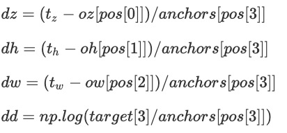

# 1. dataset 数据集加载
1. 初始化
    1. 路径解释：
        1. data_dir 为 数据存储的路径
        2. split_path 为数据集的列表
        3. idcs 排好序的文件列表 self.filenames 存储npy数据类型的数据集的位置
        4. self.sample_bboxes 存储采样bboxes内容，数据形状array[[ob1][ob2]...[obn]]
    
    2. 加载图像：
        1. 从 _label.npy文件汇总加载对应图像的标签，np.load()方法是专门加载.npy文件的方法
        2. np.all 用于判断所有的元素是否满足条件
            1. 如果标签值符合条件，将当前的lable append到labels全局列表当中，一张图片一个np类型的标签，标签中可能有多个目标
        3. 将所有尺径符合要求的label添加到self.bboxes汇总，bboxes中的每一个目标的元素的内容为[labels_index,z,x,y,d]
            如果尺寸过大，就将该bbox再一次添加1到7次。意思是如果目标过大，就将该张图片进行多次的训练
        4. self.crop = Crop(config）为剪裁器
        5. self.sample_bboxes中存储一个样本中所有的目标形状[[z,x,y,d],[obj2]...[objn]]
           而bboxes中存储的为带有序号的单个目标 ,一行代表一个目标，形状[id,z,x,y,d]
           使用id索引filenames，提取图片名称

3. get_item
    1. 训练阶段随机采样图像为打开
    
        isRandomImg = np.random.randint(2)
        
        isRandom = True
        
        否则均为False

    2. 如果不是测试阶段
        1. 如果isRandomImg==Fasle：
            1. 提取当前的bboxes
            2. 按照bboxes[0]作为下标进行图像文件读取imgs以及sample_bboxes中的bboxes
            3. isScale = True
            4. 进行图像剪裁roi的提取以及图像增强
                
                4.1 图像crop原理和步骤
                
                    crop类实现逻辑
                    0. 确定剪裁区域的起始点
                        if s>e:
                                start.append(np.random.randint(e,s))#!
                        else:
                            start.append(int(target[i])-crop_size[i]/2+np.random.randint(-bound_size/2,bound_size/2))
                    1. 获取crop的范围
                    
                        start的范围是[-corp_size/2, 512 - crop_size/2]
                        xx,yy,zz的范围是从[normstart[0],normstart[0]+normsize[0]]
                        coord 为np.concatenate(xx,yy,zz)
                        normstart = np.array(start).astype('float32') / np.array(imgs.shape[1:]) - 0.5
                        normsize = np.array(crop_size).astype('float32') / np.array(imgs.shape[1:])
                        xx = np.meshgrid(np.linspace(normstart[0], normstart[0] + normsize[0], self.crop_size[0] / self.stride),
                                indexing='ij')
                                
                    2. 提取感兴趣区域 
                        crop为图像的含有目标的感兴趣立方体区域
                        对crop进行填充，填充后的形状确保均为127*127大小
                    3. 
                        如果start 超出了图像边界，左侧填充长度为 leftpad = -start[i]，否则就不填充
                        如果crop超出了img_size,rightpad>0,就填充0，否则，就不填充    
                        rightpad = max(0,start[i]+crop_size[i]-imgs.shape[i+1])
                    4. 对 bboxes和targets进行处理，目标标签向左迁移start[i]个单位
                        target[i] = target[i] - start[i] 
                    5. 使用skimage.zoom对图像进行中心缩放，而后进行信息的填充处理
                        5.1 newpad = self.crop_size[0]-crop.shape[1:][0]
                        5.2 如果是缩小，就进行填充处理
                        5.3 对targets值以及bboxes进行缩放处理
                    6. 总结：
                        crop类是用来在全局图像中进行裁剪目标区域，剪裁的结果
                        sample, target, bboxes, coord 
                        sample: shape = crop_size 大小的
                        target： 经过处理的标签值
                        bboxes： 经过处理的bboxes
                        coord：经过归一化的"采样样本相对于整个CT图像位置坐标"，为正方体的meshgrid，数值范围为[-0.5,0.5]
                            coord 数值并没有跟随extendBox进行变换。
                
                3. 图像增强的逻辑为
                
                        1. ifrotate
                            1.1 while 循环：循环终止条件为validrot==True
                                知识点：np.dot和np.multiply 是等价的矩阵乘法
                                1.1.1 围绕中心点获得旋转的标签值，newtarget[1:3] = np.dot(rotmat,target[1:3]-size/2)+size/2，z轴不进行旋转
                                1.1.2 对标签值的旋转结果进行判断
                                    旋转的条件为np.all(newtarget[:3]>target[3]) and np.all(newtarget[:3] < np.array(sample.shape[1:4]) - newtarget[3])
                                    旋转条件的含义，旋转的角度范围大于45度
                                    validrot 取反
                                    对矩阵进行旋转
                                    如果旋转条件达不到，最多旋转3次
                        2. 维度的翻转
                            2.1对z，x,y三个轴进行permutation或者shuffle
                                知识点：shuffle 和 permutation都是洗牌的意思，两者的区别是后者在原始数据上进行操作
                        3. 在xy方向上随机的进行翻转
                            1.1  首先生成随机数，随机数的范围为-1，1
                            1.2 使用该随机数，利用索引[::-1]和[::1]决定该轴向是否flip
                            1.3 对target以及bboxes进行翻转
               
        2. isRandomImg==Fasle：
            1. 在kaggle names中加载图像和标签，crop之后进行不进行图像增强
        3. 获取标签值 self.label：
        
                1. output_size = input_size/stride 128/4=32
                2. 获得锚点框中心坐标oz,oh,ow
                3. 背景为[-1,-1,-1,-1,-1]
                4. 对于所有的目标
                   select_samples 
                   任务： bbox与anchor 两两配对，目标与anchor大小相近且b iou with anchor 大于阈值grid位置置零，
                         如果d与a差距较大，或者iou<阈值，依然为-1
                         输出的结果是[0,-1,-1,-1,-1]
                6. 限制背景坐标点数量到800个
                    self.phase == 'train' and self.num_neg > 0:
                    neg_z, neg_h, neg_w, neg_a 为没有目标的相应维度坐标索引
                    np.where 返回一个turple ，该turple元素为每个维度的索引值 长度为每个维度符合条件的长度的乘积
                    random.sample(a,b)从列表a中随机抽取b个元素
                    label清零
                    label背景设置为-1
                    
                7. 对target进行处理
                   1. target 与anchors 一一匹配
                   2. 含有target目标的地方设置为 [1, dz, dh, dw, dd]
                    idx = random.sample(range(len(iz)), 1)[0]
                    pos = [iz[idx], ih[idx], iw[idx], ia[idx]] 随机选取一个在target目标区域的坐标
                    
                    label 标签值为目标位置与grid之间的差值 / anchorsize，并没有乘以缩放因子
                    也没有归一化到(0,1)之间
            
            
                8. 数据提取器返回的值
                    return torch.from_numpy(sample), torch.from_numpy(label), coord

        