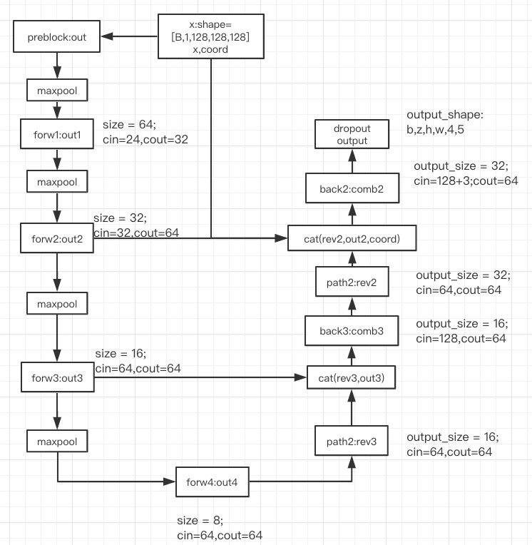

# 1. 网络结构
1. resnet18
    
    总的网络结构如下图所示
    

2. 该网络主要以3Dresnet为主要的结构

      resnet
3. encoder的结构图如下图所示

     

4. decoder的结构如下图所示

     
     
    
5. 最终输出的特征图形状为 [B,z,h,w,3,5]

        3 = Len(anchors)
        z,h,w = input_shape/stride=32
        5 = pred_conf,pred_z,pred_y,pred_x,pred_d
        
# 2 loss损失函数的定义

1. 输入数据为output 以及labels：view(-1, 5)

        1. 选择带有target的anchor对应的label和pred
            torch.unsqueeze 相当于np中的None，创建一个新的维度，expand 将维度为1的方向进行扩充
        2. pos_output ：预测正样本 选择条件 pred_conf > 0.5
           pos_labels ：标签正样 选择条件 pred_conf > 0.5
2. neg_output neg_labels 为背景部分的预测值；选择条件 label_confidence<-0.5
3. 正负样本挖掘
        0. 如果负样本的数量少于两个，不发生作用
        1. num_hard 取出前两个最大的预测结果的索引
        2. 按照索引选择neg_output, neg_labels，得到预测conf 最大的两个值，以及这两个值对应的neg_labels
        3. 负样本如此之多,只选两个？
4. 对挖掘后的负样本conf s形sigmod函数压缩
5. 输出结果

        1. 如果存储在正样本
            1.pos_prob 为sigmod后的confidence
            2. 从pos_pred  pos_label 中提取 pz, ph, pw, pd ; lz, lh, lw, ld 分别为预测和标签的正样本的四个回归值
            3. 对2中取值使用hubberloss：nn.SmoothL1Loss()类似于增强版的mse
            4. nn.BCELoss()使用交叉熵损失计算confidence loss
                分类损失的总公式：
                0.5 * bce(pos_prob, pos_labels) + 
                0.5 * bce(neg_prob, neg_labels + 1)
                pos_correct = (pos_prob.data >= 0.5).sum()
                pos_total = len(pos_prob)
            5. loss = class_loss + regress_loss*4
            返回的列表为 [loss, classify_loss_data] + regress_losses_data + [pos_correct, pos_total, neg_correct, neg_total]
            neg_correct = (neg_prob.data < 0.5).sum()
            neg_total = len(neg_prob)
        2. 不存在正样本
            返回0

使用了hubber loss, 原理如下
 

    下面是公式

 

# 3. test 部分

1. test 阶段数据集生成

        1. 输入图像形状处理到stride的整数倍
            nz, nh, nw = imgs.shape[1:]
            pz = int(np.ceil(float(nz) / self.stride)) * self.stride
        2. xx, yy, zz mesh_grid坐标，数值范围从[-0.5,0.5]
        3. split_comber将图像和coord进行分割，处理成多个128的方块
            0. __init__:数据初始化 side_len = 144, max_stride=16, stride= 16, margin = 32, pad_value=170
            1. split 方法
                0. 如果参数为空，参数设置为0.中初始化参数
                1. zhw三个方向上分块数量确定,并在三个维度的后方进行padding ，padding值为170
                    nz = int(np.ceil(float(z) / side_len))
                    return : nzhw = [nz, nh, nw]
                2. 使用3级for循环nz, nh, nw , 提取块列表，列表长度为 nz, nh, nw
                    return ： splits
            2. combine 方法:
                1中split方法操作的逆操作
        4. 将图像像素归一化[-0.5,0.5]
        5. 数据生成后, 外部测试器将结果进行整合
        6. return
               imgs: nz*nh*nw长度的np, 形状是[nznhnw,1,208,208,208],形状中的1由np.load()加载数据引起
               bboxes: label,一个ct图中的多个目标 
               coord2: 与imgs进行同样的分块后坐标索引
               nzhw: 分块的个数'''
1. 封装一次不行就多封装几次
    split_comber = data_loader.dataset.split_comber
2. 对每个块进行检测
3. 将每个块输出的结果进行融合，通过conf得到目标可能的位置

        1. 生成gird oz oh ow
        2. 输出值进行偏移和缩放
        3. 对2.得到的结果进行阈值选择，得到mask[xx, yy, zz, aa]坐标

# 4. cross entropy loss

1. 交叉熵损失和多项逻辑斯特回归

    首先我们来看逻辑斯特回归，s形函数将[-infity,infinity]压缩到[0,1]之间，正值被
    压缩到[0.5,1], 负值被压缩到[0,0.5]之间。

     
    
        交叉熵损失的定义函数为

    

        j为预测的类别索引

        1. softmax可以是多分类输出的激活函数，用于对多个分类的结果进行归一化
            与logistics回归相同，一个是用于二分类的激活，另一个是用来多分类的激活
        2. 在深度学习的输出层，常用softmax激活函数将多分类输出结果进行归一化。
        3. softmax 经常与cross_entropy 进行组合使用
        4. 在pytorch 中 nn.CrossEntropyLoss 的公式为
    
    

        与李航的书本中二分类的逻辑斯特回归的极大似然推到结果一致：
        是否可以这么理解：softmax的极大对数似然就是交叉熵损失函数？

2. Binary Cross Entropy 
        
        1. nn.BCELoss 公式的定义
    
        
        2. 与3.1 中的交叉熵损失作对比，交叉熵损失输出的是一个标量
        而bce输出的是一个长度为nc的向量
        
3. BCEWithLogitsLoss
    
        1. 对3.2 中的bceloss中的预测值使用逻辑斯特函数
        优势：预测的结果更加的稳定
        
     
